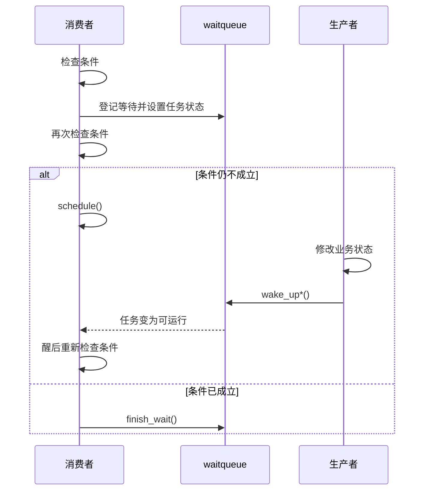

# 第1章\_等待队列

## 1.1\_等待队列解决什么问题

等待队列让任务在业务条件不成立时睡眠，并在条件可能发生变化时被唤醒重新检查。它保存“谁在等待”，不保存业务事件本身。



唤醒只表示“条件可能变化，请重新检查”，不保证任务立即运行，也不保证任务运行时条件仍然成立。

## 1.2\_数据结构

等待队列头包含锁和等待项链表；等待项保存任务或自定义对象、唤醒回调、标志和链表节点。概念结构如下：

```c
struct wait_queue_head {
    spinlock_t lock;
    struct list_head head;
};

struct wait_queue_entry {
    unsigned int flags;
    void *private;
    wait_queue_func_t func;
    struct list_head entry;
};
```

实际字段、类型别名和初始化宏以当前内核 `include/linux/wait.h` 为准。普通驱动优先使用 `wait_event*()` 宏，不要为常规条件等待手写队列操作。

## 1.3\_标准条件等待

```c
DECLARE_WAIT_QUEUE_HEAD(readq);

ret = wait_event_interruptible(readq,
        data_available(dev) || READ_ONCE(dev->disconnected));
if (ret)
    return ret;

/* 醒来后在保护业务状态的锁下重新验证。 */
mutex_lock(&dev->lock);
if (dev->disconnected)
    ret = -ENODEV;
else if (!data_available_locked(dev))
    ret = -EAGAIN;
else
    ret = consume_data_locked(dev);
mutex_unlock(&dev->lock);
```

`wait_event*()` 会循环检查条件；条件初始成立时直接返回。等待接口可能睡眠，只能用于允许调度的上下文，不能在 hardirq、softirq、禁抢占区或持有自旋锁时调用。

## 1.4\_生产者必须先修改状态再唤醒

```c
spin_lock_irqsave(&dev->qlock, flags);
enqueue_record(dev, record);
spin_unlock_irqrestore(&dev->qlock, flags);

wake_up_interruptible(&dev->readq);
```

如果先唤醒、后修改条件，等待者可能运行、检查到旧状态并再次睡眠，此后再没有新的唤醒。

业务状态和唤醒队列是两套东西：锁或明确的 release/acquire 协议负责发布状态，`wake_up*()` 负责让等待者可运行。不能把唤醒函数内部的调度屏障概括成“自动发布所有业务数据”。

## 1.5\_为什么不会丢失检查\_睡眠窗口

底层等待循环的关键顺序是先把任务登记到队列并设置睡眠状态，再检查条件：

```c
DEFINE_WAIT(wait);

for (;;) {
    prepare_to_wait(&dev->readq, &wait, TASK_INTERRUPTIBLE);

    if (condition_is_true(dev))
        break;
    if (signal_pending(current)) {
        ret = -ERESTARTSYS;
        break;
    }

    schedule();
}

finish_wait(&dev->readq, &wait);
```

若生产者在登记之后、`schedule()` 之前唤醒任务，任务状态会恢复为 runnable，随后 `schedule()` 不会造成永久丢失事件。手写循环必须始终调用 `finish_wait()`，包括信号和错误路径，以恢复任务状态并移除等待项。

上例只展示结构；实际代码优先使用宏族，因为宏已经处理多种任务状态、信号和超时细节。

## 1.6\_接口族与返回值

| 接口 | 信号行为 | 返回值重点 |
| --- | --- | --- |
| `wait_event()` | 不响应信号 | 条件成立后返回 |
| `wait_event_interruptible()` | 响应可处理信号 | 0 成功，通常以 `-ERESTARTSYS` 表示被信号打断 |
| `wait_event_killable()` | 响应致命信号 | 0 成功，负错误码失败 |
| `wait_event_timeout()` | 不响应信号 | 0 超时，非 0 表示条件成立及剩余时间语义 |
| `wait_event_interruptible_timeout()` | 信号或超时 | 负值信号、0 超时、正值条件成立 |
| `wait_event_freezable()` | 可参与 freezer | 用于明确需要冻结语义的内核任务 |

不同宏的精确返回值和“边界时刻条件刚成立”语义可能不同，调用处应以对应宏注释为准，不能统一写成简单布尔值。

## 1.7\_任务状态怎么选

| 状态 | 可被什么唤醒 | 使用考虑 |
| --- | --- | --- |
| `TASK_INTERRUPTIBLE` | 条件唤醒或普通信号 | 面向用户请求的阻塞 I/O 常用，必须返回信号错误 |
| `TASK_KILLABLE` | 条件唤醒或致命信号 | 允许系统终止长期内核等待 |
| `TASK_UNINTERRUPTIBLE` | 主要由显式条件唤醒 | 只在协议确实不能中断时使用，错误会形成 D 状态挂死 |

不要为了省略错误处理默认选择 uninterruptible。与可能失联的硬件交互时通常还应设计超时、复位和停止路径。

## 1.8\_独占等待与惊群

非独占等待者在匹配唤醒时通常都会被唤醒；独占等待项允许唤醒路径在处理一定数量的独占等待者后停止，从而减少多个消费者争夺单个资源的惊群。

```c
ret = wait_event_interruptible_exclusive(dev->readq,
        data_available(dev));
```

`wake_up()` 不能简单描述成“只唤醒一个”或“唤醒所有”：它会处理所有匹配的非独占等待者，并按接口参数限制独占等待者数量。选择 exclusive 前要确认事件确实只能被一个消费者消费；广播状态变化不能误用独占等待。

## 1.9\_锁与内存序

首选做法是让生产者和消费者用同一把锁保护复合条件：

```c
/* 生产者 */
spin_lock(&dev->lock);
dev->ready = true;
publish_fields(dev);
spin_unlock(&dev->lock);
wake_up(&dev->wq);
```

消费者醒来后取得同一把锁再读取字段。锁建立数据顺序，等待队列建立调度关系。

若使用无锁标志，必须设计成对的 release/acquire 或内核文档规定的屏障模式。`READ_ONCE()/WRITE_ONCE()` 主要约束单次访问，不自动形成完整 happens-before。

`waitqueue_active()` 是无锁观察提示，调用者使用它跳过 `wake_up()` 时必须严格遵守内核注释要求的屏障配对。多数驱动不需要这种微优化，直接调用 wake_up 更容易审计。

## 1.10\_等待队列与\_poll

`.poll()` 中的 `poll_wait(file, &dev->wq, wait)` 只是登记等待队列，不会在 poll 回调里阻塞。正确顺序是先登记，再检查 readiness，避免事件发生在检查和登记之间。

生产者修改状态后可用 `wake_up_interruptible_poll()` 携带 poll mask 唤醒。poll 和阻塞 read 应围绕同一业务条件设计，否则可能一个报告可读、另一个醒来却无数据。

## 1.11\_停止与生命周期

remove 或关闭路径必须让等待者有机会退出：

```c
WRITE_ONCE(dev->disconnected, true);
wake_up_interruptible_all(&dev->readq);
```

随后等待者在条件中观察 disconnected 并返回错误。等待队列头和业务对象必须活到所有等待者退出；仅唤醒一次后立即释放对象可能让尚未运行的任务 UAF。


## 1.12\_常见错误

| 错误 | 后果 |
| --- | --- |
| 把等待队列当事件存储 | 事件发生在无人等待时被丢失 |
| 先 wake 再修改条件 | 等待者检查旧条件后再次睡眠 |
| 用 `if` 代替循环重检 | 假唤醒或其他消费者抢先消费后使用无效状态 |
| 持有生产者需要的 mutex 睡眠 | 永久死锁 |
| 忽略 interruptible/timeout 返回值 | 把信号或超时当成功 |
| 手写循环忘记 `finish_wait()` | 任务状态和队列项残留 |
| 只靠 ONCE 和 wake_up 保护复合状态 | 缺少可证明的内存序和互斥 |
| remove 唤醒后立即 free | 等待者尚未退出导致 UAF |
| 广播事件使用 exclusive wait | 部分等待者永远收不到状态变化 |

## 1.13\_核对表

- 业务条件保存在哪里，事件早于等待者到达时是否仍可观察？
- 生产者是否先修改条件再唤醒？
- 等待者是否始终循环重检，并正确处理信号和超时？
- 条件由锁还是明确的无锁内存序保护？
- 当前上下文是否允许睡眠？
- 独占等待是否真的符合单消费者语义？
- remove 如何阻止新等待、唤醒旧等待并等待它们退出？

需要保存“工作已经完成”的令牌或广播完成状态时，继续阅读 [completion 完成量](P02_completion_完成量.md)。
