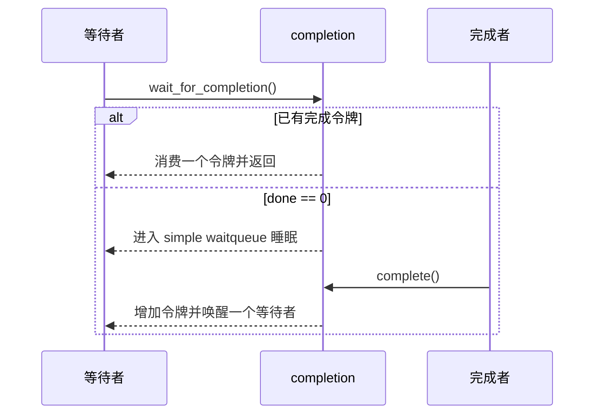
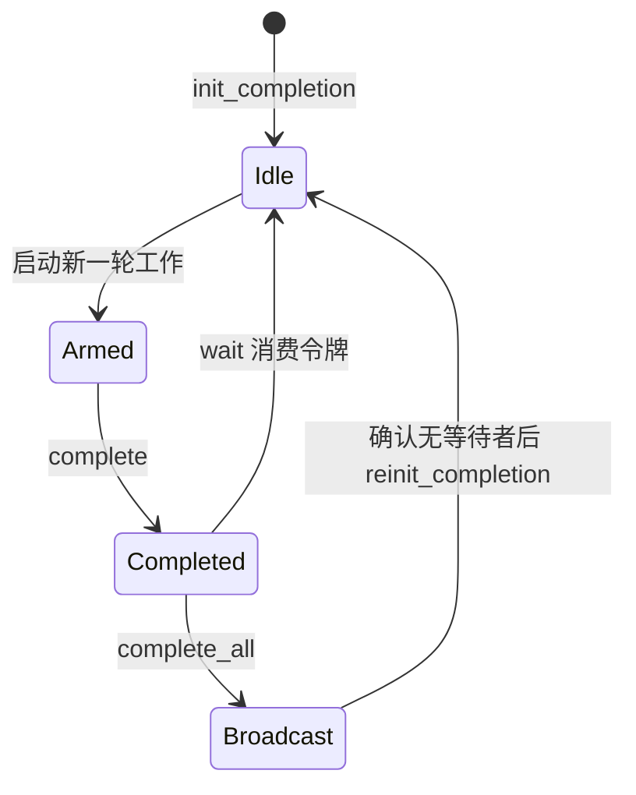

# 第2章\_completion\_完成量

## 2.1\_completion\_解决什么问题

completion 表达的是“某项工作已经完成，等待方现在可以继续”，而不是共享资源的所有权或容量。它常用于：

- 线程等待中断处理程序报告一次硬件操作完成；
- `probe()` 等待异步初始化结束；
- 停机路径等待内核线程退出；
- 一个执行流等待另一个执行流到达确定的生命周期点。



completion 会记住先发生的完成事件：即使 `complete()` 早于 `wait_for_completion()`，后来的等待者仍可消费该完成令牌。这是它与“只唤醒、不保存业务条件”的裸等待队列之间最重要的区别。

## 2.2\_数据结构与计数语义

Linux 6.12 的核心结构可以概括为：

```c
struct completion {
    unsigned int done;
    struct swait_queue_head wait;
};
```

这里使用的是 simple waitqueue，而不是普通 `wait_queue_head_t`。`done` 也不只是布尔标志：

- `complete()` 增加一个完成令牌，并唤醒一个等待者；没有等待者时令牌会保留。
- `wait_for_completion*()` 在取得令牌后通常消费一个 `done` 计数。
- 多次 `complete()` 可以累计多个令牌，直到无符号计数的饱和保护边界。
- `complete_all()` 将状态设置为饱和值并唤醒所有等待者；之后的等待也会直接通过，直到显式重新初始化。
- `reinit_completion()` 直接把 `done` 置零，但不会检查是否仍有等待者。

因此，把 completion 描述成“`done` 只能为 0 或 1 的严格 single-shot 标志”是错误的。工程上常把它用于一次工作的一次完成握手，但底层具有计数和广播语义。

## 2.3\_初始化与生命周期

```c
static DECLARE_COMPLETION(fw_loaded);

struct my_device {
    struct completion transfer_done;
};

static int my_probe(struct platform_device *pdev)
{
    struct my_device *m = platform_get_drvdata(pdev);

    init_completion(&m->transfer_done);
    return 0;
}
```

| 接口 | 用途 | 关键限制 |
| --- | --- | --- |
| `DECLARE_COMPLETION(name)` | 静态声明并初始化 | 初始 `done == 0` |
| `init_completion(x)` | 首次初始化 | 会初始化等待队列；不能在仍有人等待时重复调用 |
| `reinit_completion(x)` | 已初始化对象进入下一轮前清零 | 不重新初始化队列，也不保证等待者已经离开 |

completion 所在对象必须覆盖所有等待者和完成者的生命周期。把 completion 放在栈上时，函数返回前必须证明异步完成路径不会再访问它。

## 2.4\_等待接口

| 接口 | 是否响应信号 | 返回值要点 |
| --- | --- | --- |
| `wait_for_completion()` | 否 | 无返回值，一直等待完成令牌 |
| `wait_for_completion_interruptible()` | 普通信号 | 成功为 0，被信号打断返回负错误码 |
| `wait_for_completion_killable()` | 致命信号 | 成功为 0，被信号打断返回负错误码 |
| `wait_for_completion_timeout()` | 否 | 0 表示超时，非 0 是剩余 jiffies |
| `wait_for_completion_interruptible_timeout()` | 是 | 0 超时，负值为信号错误，正值为剩余 jiffies |
| `try_wait_for_completion()` | 不睡眠 | 有令牌则消费并返回 true |
| `completion_done()` | 不睡眠 | 仅观察是否存在已完成状态，不消费令牌；结果只是瞬时快照 |

等待接口可能睡眠，必须在允许调度的上下文调用；不能在硬中断、禁抢占区或持有自旋锁时等待。

超时接口必须区分三种结果，不能把非零一律当错误：

```c
long ret;

ret = wait_for_completion_interruptible_timeout(
        &m->transfer_done, msecs_to_jiffies(500));
if (ret == 0)
    return -ETIMEDOUT;
if (ret < 0)
    return ret;

/* ret > 0：获得完成令牌。 */
```

## 2.5\_完成接口与调用上下文

| 接口 | 唤醒范围 | 状态变化 |
| --- | --- | --- |
| `complete(x)` | 一个等待者 | 增加一个完成令牌 |
| `complete_all(x)` | 所有等待者 | 将 `done` 设置为广播完成状态 |

`complete()` 和 `complete_all()` 不睡眠，可以从中断上下文调用。它们表达事件完成，不负责取消硬件、不负责对象引用，也不替代保护其他共享字段的锁。

```c
static irqreturn_t my_irq(int irq, void *data)
{
    struct my_device *m = data;
    u32 status = readl(m->regs + STATUS);

    if (!(status & TRANSFER_DONE))
        return IRQ_NONE;

    writel(TRANSFER_DONE, m->regs + STATUS);
    complete(&m->transfer_done);
    return IRQ_HANDLED;
}
```

## 2.6\_重复使用的正确状态机



常规一发一收模式不需要每轮都无条件 `reinit_completion()`：如果等待者已经消费了唯一令牌，`done` 会回到零。只有协议明确需要丢弃旧完成状态、开始全新一轮，或者此前调用过 `complete_all()` 时，才考虑 reinit；调用前必须证明旧一轮的完成者和等待者都已结束。

危险写法：

```c
/* 错误：另一个等待者可能仍在队列中，完成者也可能正在 complete()。 */
reinit_completion(&m->transfer_done);
```

这可能丢失并发到达的完成事件，或者让旧等待者永远睡眠。正确做法是用更高层状态锁、停止协议或单一所有者保证“轮次切换”不存在并发。

## 2.7\_completion\_与等待队列\_信号量的边界

| 机制 | 表达的事实 | 状态由谁维护 | 典型用途 |
| --- | --- | --- | --- |
| completion | 工作到达完成点，存在可消费令牌或广播完成状态 | completion 内部的 `done` | 完成握手、退出确认 |
| waitqueue | 任意业务条件当前是否成立 | 调用者维护并在醒后重检 | 数据可读、队列非空、状态改变 |
| semaphore | 当前还有多少个资源额度 | semaphore 的计数 | 有限资源池、并发额度 |
| mutex | 谁拥有排他临界区 | 锁所有者 | 共享状态互斥 |

completion 虽然带计数，但它的语义仍然是“完成事件”，不应因为 `done` 能累计就把它当通用 semaphore 使用。

## 2.8\_停机与对象生命周期

在 `remove()` 或模块卸载路径中，必须先阻止新工作产生，再取消/停止硬件或异步执行源，最后等待已经发出的工作退出。仅等待 completion 而不关闭生产者，会出现刚等完又产生新工作的竞态。


如果完成者位于可卸载模块的异步回调中，还要保证模块代码本身在回调执行完之前不会卸载。

## 2.9\_常见错误

| 错误 | 后果 | 修正 |
| --- | --- | --- |
| 把 `done` 说成只能取 0/1 | 错误理解多次 `complete()` 和令牌累计 | 按计数令牌理解 `complete()` |
| 每轮开始无条件 `reinit_completion()` | 丢失提前到达或并发到达的完成 | 用轮次协议证明可以安全清零 |
| `complete_all()` 后直接复用 | 后续等待全部立即返回 | 所有旧等待者离开后再 reinit |
| 在原子上下文等待 | 睡眠于原子上下文 | 只在可调度上下文使用 wait 接口 |
| 超时返回后立即释放对象 | 中断或异步完成者随后 UAF | 先停止并同步完成源，再释放对象 |
| 用 completion 保护复合共享状态 | 事件到了，但字段仍可能竞态 | 另用锁、RCU、seqcount 等保护数据 |
| 只调用 `complete()` 却有多个广播等待者 | 只有一个令牌、一个等待者通过 | 明确使用多次 complete 或 complete_all |

## 2.10\_核对表

- 等待的是“完成事件”还是任意条件？
- 是否允许睡眠，信号和超时返回值是否完整处理？
- 一个 `complete()` 对应几个消费者？完成令牌是否可能累计？
- 是否真的需要 `reinit_completion()`，又由什么协议排除并发？
- `complete_all()` 后是否等所有旧等待者离开再复用？
- 超时、remove 和错误路径是否先同步完成者，再释放 completion 所在对象？

上一篇：[等待队列](P01_等待队列.md)。
