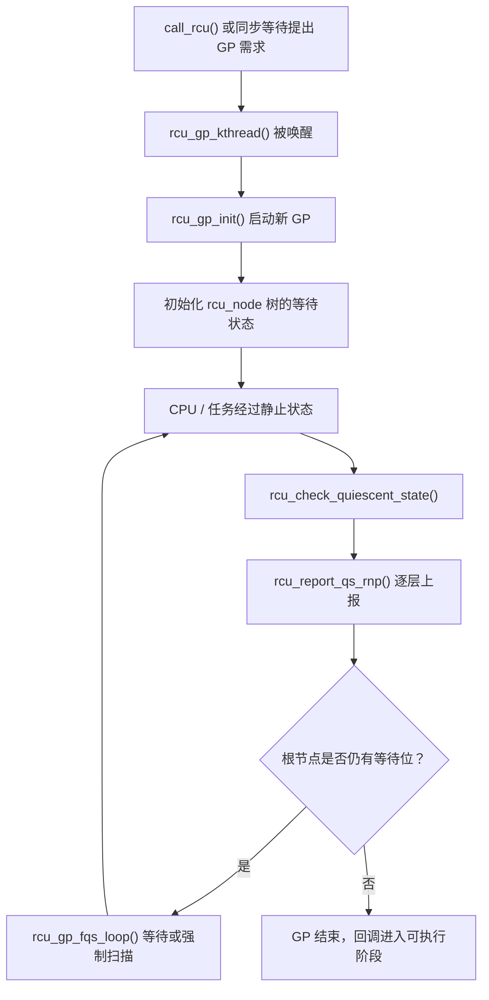
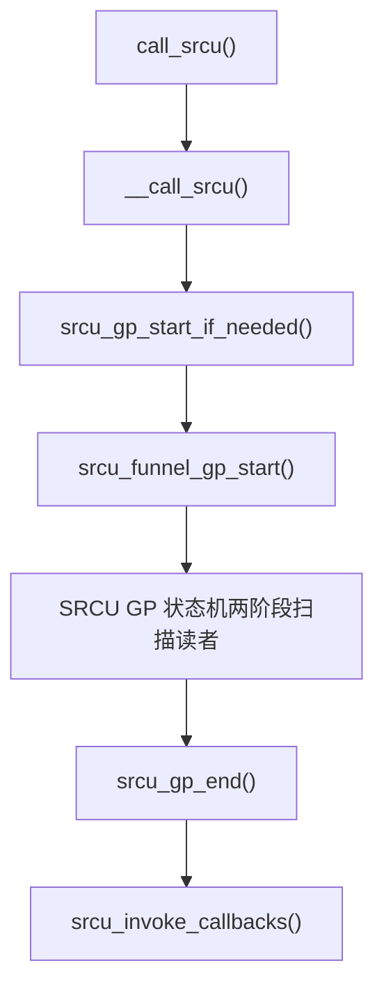

# 第1章\_Linux\_6.12\_Tree\_RCU\_与\_SRCU\_源码导读

## 1.1\_版本与阅读边界

本章对应 NXP Linux 6.12.20 源码，只解释仓库中已保存的 Tree RCU 和 Tree SRCU 核心文件。本章是版本化实现证据，前面章节仍负责总结跨版本成立的机制模型。

## 1.2\_源码文件地图

| 文件 | 主要内容 |
| --- | --- |
| [`include/linux/rcupdate.h`](../linux/include/linux/rcupdate.h) | 公共 RCU API、指针发布/取得、读侧标记、`kfree_rcu()` |
| [`include/linux/rculist.h`](../linux/include/linux/rculist.h) | list/hlist 的 RCU 发布、删除和遍历宏 |
| [`include/linux/rcu_segcblist.h`](../linux/include/linux/rcu_segcblist.h) | 分段回调列表的公共结构与接口 |
| [`kernel/rcu/tree.h`](../linux/kernel/rcu/tree.h) | `rcu_node`、`rcu_data`、`rcu_state` 等 Tree RCU 核心结构 |
| [`kernel/rcu/tree.c`](../linux/kernel/rcu/tree.c) | GP 线程、静止状态上报、回调推进与执行 |
| [`kernel/rcu/tree_plugin.h`](../linux/kernel/rcu/tree_plugin.h) | PREEMPT_RCU 等配置相关的读者跟踪实现 |
| [`kernel/rcu/tree_exp.h`](../linux/kernel/rcu/tree_exp.h) | expedited grace period |
| [`kernel/rcu/tree_nocb.h`](../linux/kernel/rcu/tree_nocb.h) | `rcu_nocbs` 回调 offload |
| [`kernel/rcu/tree_stall.h`](../linux/kernel/rcu/tree_stall.h) | RCU CPU stall 检测与诊断 |
| [`include/linux/srcu.h`](../linux/include/linux/srcu.h) | SRCU 公共 API 和读侧封装 |
| [`include/linux/srcutree.h`](../linux/include/linux/srcutree.h) | `srcu_data`、`srcu_node`、`srcu_usage`、`srcu_struct` |
| [`kernel/rcu/srcutree.c`](../linux/kernel/rcu/srcutree.c) | Tree SRCU 初始化、GP、回调和同步等待 |

## 1.3\_Tree\_RCU\_的三层状态

### 1.3.1\_rcu\_data

`struct rcu_data` 是每 CPU 状态，它把当前 CPU 与所属 `rcu_node` 叶节点关联起来，并保存：

- 当前 CPU 观察到的 GP 序列与静止状态。
- 该 CPU 的回调分段列表 `cblist`。
- dynticks、nocb、延迟静止状态等与每 CPU 执行相关的信息。

### 1.3.2\_rcu\_node

`struct rcu_node` 构成一棵分层树。叶节点聚合一组 CPU 的静止状态，中间节点继续向上聚合。`qsmask` 类位图表示当前 GP 仍在等待哪些子节点或 CPU。

这种层次聚合避免了大型机器上所有 CPU 频繁争用同一个全局锁。

### 1.3.3\_rcu\_state

`struct rcu_state` 表示 Tree RCU 全局状态，包括 `gp_seq`、GP 线程、`rcu_node` 树和宽限期控制信息。源码中的全局 `rcu_state` 实例是普通 Tree RCU 宽限期协调的中心。

## 1.4\_一次宽限期的主线



### 1.4.1\_启动

`rcu_gp_kthread()` 是普通 GP 管理线程。它在存在新 GP 需求时调用 `rcu_gp_init()`，后者通过 `rcu_seq_start()` 推进 `rcu_state.gp_seq`，并对 CPU hotplug 与节点等待状态进行初始化。

### 1.4.2\_等待与强制扫描

`rcu_gp_fqs_loop()` 在 GP 期间等待静止状态上报。必要时它会触发 force-quiescent-state 扫描，处理 idle/EQS、dynticks、CPU hotplug 以及长时间未报告的 CPU。

### 1.4.3\_每\_CPU\_核心处理

`rcu_core()` 运行每 CPU RCU 核心工作：

1. 处理延后的静止状态。
2. 调用 `rcu_check_quiescent_state()` 更新 GP 状态。
3. 将新回调加速到对应的 GP 分段。
4. 对已经可执行的回调调用 `rcu_do_batch()`。

## 1.5\_回调为什么需要分段列表

`struct rcu_segcblist` 不是一个单纯 FIFO。它把回调按 GP 进度划分成不同段，使新注册、已分配 GP、已等待完成和可执行回调不会混为一谈。

可以用下列抽象理解：

```text
新回调
   ↓ 分配目标宽限期
等待对应 GP
   ↓ GP 完成后推进
可执行回调
   ↓ rcu_do_batch()
调用 func(struct rcu_head *)
```

`call_rcu()` 本身只负责将回调交给这套系统；它不是立即启动一个专属 GP，多个回调可以共享后续宽限期进度。

## 1.6\_synchronize\_rcu()与\_call\_rcu()

`synchronize_rcu()` 是阻塞等待接口，源码会根据当前配置走普通或 expedited 路径。它的 lockdep 检查会报告在 RCU 读侧临界区内调用的非法情况。

`call_rcu()` 通过 `__call_rcu_common()` 排队回调，调用者不等待 GP。两者都依赖 Tree RCU 的 GP 推进，但交付方式不同。

## 1.7\_Tree\_SRCU\_数据结构

| 结构 | 作用 |
| --- | --- |
| `srcu_struct` | 使用者持有的 SRCU 域入口 |
| `srcu_usage` | 该域的 GP 序列、锁、工作和生命期状态 |
| `srcu_data` | 每 CPU 的读计数、锁和回调列表 |
| `srcu_node` | 层次聚合读计数与回调进度 |

Tree SRCU 通过两个 index 分期统计读者。`synchronize_srcu()` 的源码注释明确描述了“先等待一个 index 的计数排空，翻转 index，再等待另一个”的基本模型。

## 1.8\_Tree\_SRCU\_回调与宽限期主线



`call_srcu()` 的回调在 process context 执行，但 Linux 6.12.20 的注释仍要求回调必须快速且不得阻塞。“SRCU 读者可阻塞”不能推导出“SRCU 回调也可以任意阻塞”。

`synchronize_srcu()` 内部通过一个栈上 `rcu_synchronize` 对象注册唤醒回调，然后等待 completion。这正是它必须在 process context 调用、且不得从同域读侧内调用的直接实现证据。

## 1.9\_建议的源码阅读顺序

1. 先从 `rcupdate.h` 阅读 `rcu_assign_pointer()`、`rcu_dereference()` 和读侧封装。
2. 阅读 `tree.h` 中的 `rcu_data`、`rcu_node`、`rcu_state`。
3. 沿 `call_rcu()` 进入回调排队，再阅读 `rcu_segcblist` 的分段模型。
4. 沿 `rcu_gp_kthread()` 阅读 `rcu_gp_init()`、`rcu_gp_fqs_loop()` 和 GP 结束。
5. 从 `rcu_core()` 进入每 CPU 静止状态上报与回调执行。
6. 最后对照 `srcu.h`、`srcutree.h` 和 `srcutree.c`，比较 Tree SRCU 的私有域和两 index 模型。

## 1.10\_源码阅读验收

1. 能画出 `rcu_data` → `rcu_node` → `rcu_state` 的层次关系。
2. 能从 `call_rcu()` 追踪到回调入队、GP 推进和 `rcu_do_batch()`。
3. 能解释 `qsmask` 类状态为什么需要在 `rcu_node` 树中逐层聚合。
4. 能解释 `rcu_segcblist` 为什么不能只是一个普通 FIFO。
5. 能说明 Tree SRCU 两 index 读计数与私有域的关系。

专题入口：[RCU 专题大纲](../../../knowledge/linux/synchronization/rcu/大纲.md)。

